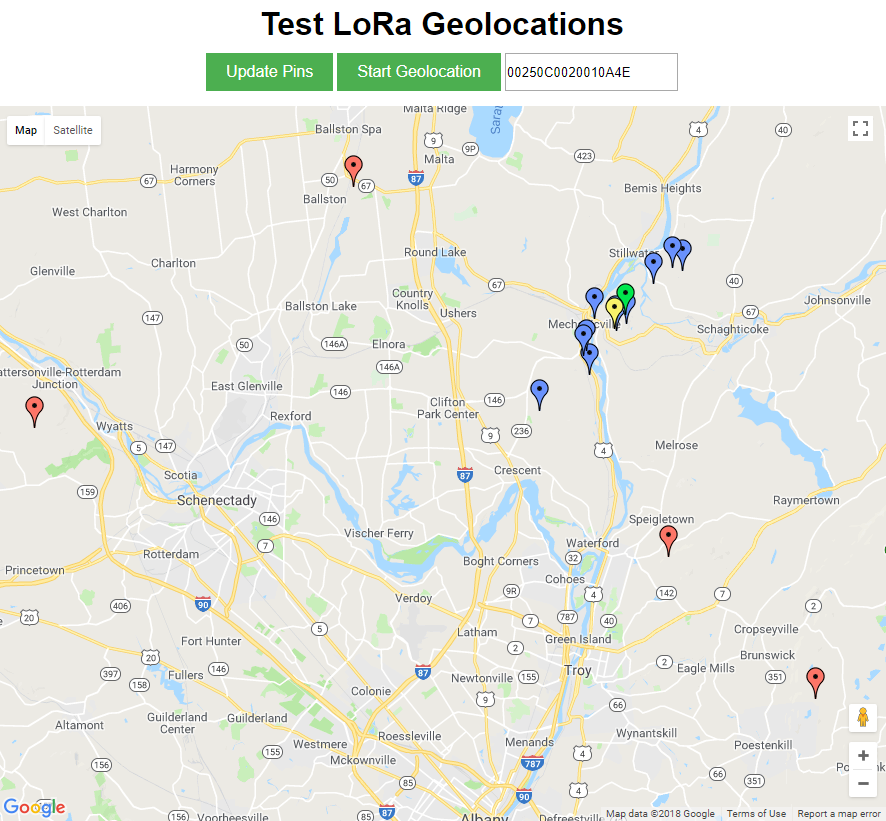

# LoRa-Geolocation

The geolocation of a LoRaWAN end device can be estimated without GPS using a technique called multilateration. This technique consumes time difference of arrival (TDOA) data measured at three or more time synchronized gateways with known locations. The LoRa-Geolocation project contains a python implementation of Foy's method (https://ieeexplore.ieee.org/document/4101619/) used to solve the multilateration problem.

## Dependencies

The python modules used in this project are listed in the ```requirements.txt``` file.

### Install from PyPI with pip
```
$ python3 -m pip install -r requirements.txt
```

## How to use

```
from geolocation_engine import *

uplinks = list()

# speed of light = 299792458 m/s

# distance to dev = 8863  meters ToF = 0.000029563 sec   
uplinks.append(Uplink(time=29563, rssi=70, snr=-1.75, bstn_eui='FF250C00010001A8',
                      bstn_lat=43.128362, bstn_lng=-70.742126))

# distance to dev = 14730 meters ToF = 0.000049133 sec
uplinks.append(Uplink(time=49133, rssi=72, snr=-3.75, bstn_eui='FF250C00010001A9',
                      bstn_lat=42.951207, bstn_lng=-70.895935))

# distance to dev = 14850 meters ToF = 0.000049534 sec
uplinks.append(Uplink(time=49534, rssi=71, snr=-2.75, bstn_eui='FF250C00010001A7',
                      bstn_lat=43.118840, bstn_lng=-70.941940))

tx = Transaction(dev_eui='00000000FFFFFFFF', join_id=1, seq_no=10, datarate=0,
                 uplinks=uplinks)

location_engine = LocationEngine(transaction=tx, debug=False)

lat, lng = location_engine.compute_device_location()
```

## How to run tests

Compute location with generated time data:
```
$ python3 test_geolocation_engine.py -c
```

Compute location with real time data:
```
$ python3 run_geolocation_engine.py -d example_data/geo_ft_jan_18.db -e 00250C0020018C26
```

Compute locations with real time data and view locations on a map:
```
$ python3 python start_server.py -b -d example_data/geo_n_albany.db -p 8001
```


